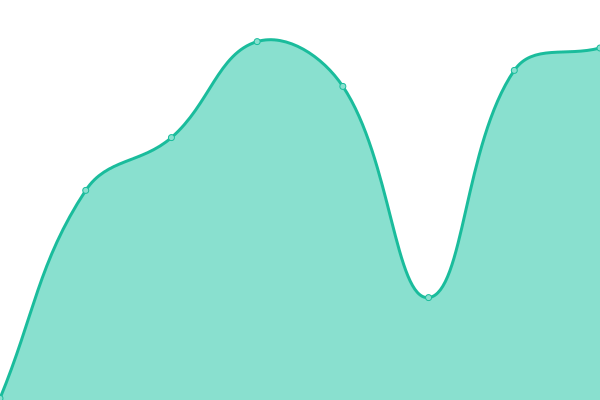
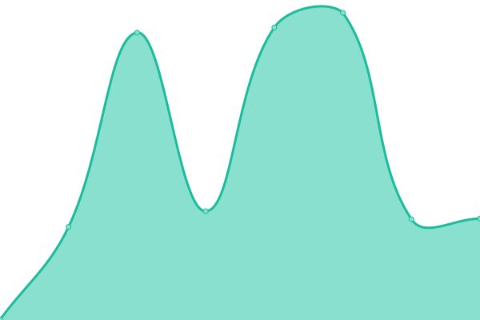
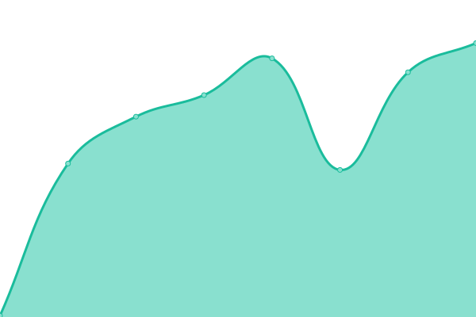
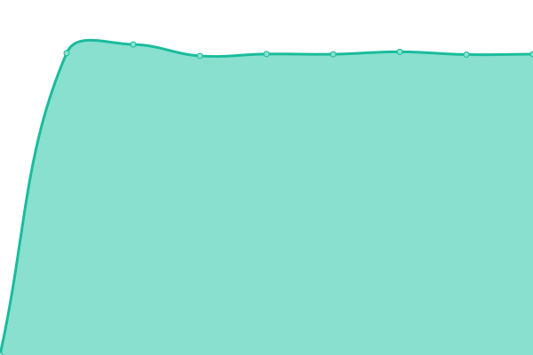
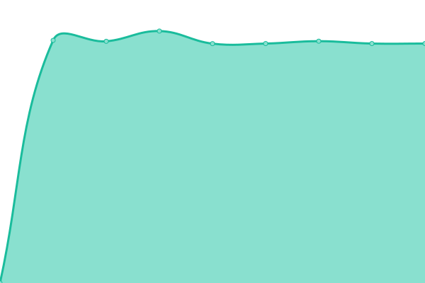
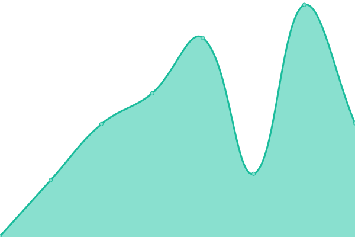
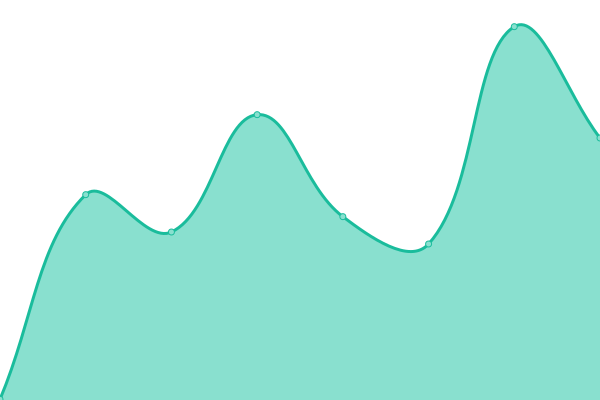

# [📈 Live Status](https://status.shuuji3.xyz): <!--live status--> **🟧 Partial outage**

This repository contains the open-source uptime monitor and status page for [TAKAHASHI Shuuji](https://shuuji3.xyz), powered by [Upptime](https://github.com/upptime/upptime).

With [Upptime](https://upptime.js.org), you can get your own unlimited and free uptime monitor and status page, powered entirely by a GitHub repository. We use [Issues](https://github.com/shuuji3/status/issues) as incident reports, [Actions](https://github.com/shuuji3/status/actions) as uptime monitors, and [Pages](https://status.shuuji3.xyz) for the status page.

<!--start: status pages-->
<!-- This summary is generated by Upptime (https://github.com/upptime/upptime) -->
<!-- Do not edit this manually, your changes will be overwritten -->
<!-- prettier-ignore -->
| URL | Status | History | Response Time | Uptime |
| --- | ------ | ------- | ------------- | ------ |
|  [status](https://status.shuuji3.xyz) | 🟩 Up | [status.yml](https://github.com/shuuji3/status/commits/HEAD/history/status.yml) | 

 199ms
     
 | 

<a href="https://status.shuuji3.xyz/history/status">0.00%</a>
    

|  [www](https://www.shuuji3.xyz) | 🟩 Up | [www.yml](https://github.com/shuuji3/status/commits/HEAD/history/www.yml) | 

 767ms
     
 | 

<a href="https://status.shuuji3.xyz/history/www">100.00%</a>
    

|  [weblog](https://weblog.shuuji3.xyz) | 🟩 Up | [weblog.yml](https://github.com/shuuji3/status/commits/HEAD/history/weblog.yml) | 

 210ms
     
 | 

<a href="https://status.shuuji3.xyz/history/weblog">100.00%</a>
    

|  [linkding](https://linkding.shuuji3.xyz) | 🟥 Down | [linkding.yml](https://github.com/shuuji3/status/commits/HEAD/history/linkding.yml) | 

 8777ms
     
 | 

<a href="https://status.shuuji3.xyz/history/linkding">0.00%</a>
    

|  [pds](https://pds.shuuji3.xyz) | 🟥 Down | [pds.yml](https://github.com/shuuji3/status/commits/HEAD/history/pds.yml) | 

 8743ms
     
 | 

<a href="https://status.shuuji3.xyz/history/pds">0.00%</a>
    

|  [takahe](https://takahe.shuuji3.xyz) | 🟥 Down | [takahe.yml](https://github.com/shuuji3/status/commits/HEAD/history/takahe.yml) | 

 8755ms
     
 | 

<a href="https://status.shuuji3.xyz/history/takahe">0.00%</a>
    

|  [argocd](https://argocd.shuuji3.xyz) | 🟥 Down | [argocd.yml](https://github.com/shuuji3/status/commits/HEAD/history/argocd.yml) | 

 8747ms
     
 | 

<a href="https://status.shuuji3.xyz/history/argocd">0.00%</a>
    

|  [google-engineering-practices.translation](https://google-engineering-practices.translation.shuuji3.xyz) | 🟩 Up | [google-engineering-practices-translation.yml](https://github.com/shuuji3/status/commits/HEAD/history/google-engineering-practices-translation.yml) | 

 150ms
     
 | 

<a href="https://status.shuuji3.xyz/history/google-engineering-practices-translation">100.00%</a>
    

|  [psycopg3-ja.translation](https://psycopg3-ja.translation.shuuji3.xyz) | 🟩 Up | [psycopg3-ja-translation.yml](https://github.com/shuuji3/status/commits/HEAD/history/psycopg3-ja-translation.yml) | 

 280ms
     
 | 

<a href="https://status.shuuji3.xyz/history/psycopg3-ja-translation">100.00%</a>
    

|  [smart-health-cards-framework.translation](https://smart-health-cards-framework.translation.shuuji3.xyz) | 🟩 Up | [smart-health-cards-framework-translation.yml](https://github.com/shuuji3/status/commits/HEAD/history/smart-health-cards-framework-translation.yml) | 

 165ms
     
 | 

<a href="https://status.shuuji3.xyz/history/smart-health-cards-framework-translation">100.00%</a>
    

<!--end: status pages-->

[**Visit our status website →**](https://status.shuuji3.xyz)

## 📄 License

- Powered by: [Upptime](https://github.com/upptime/upptime)
- Code: [MIT](./LICENSE) © [Anand Chowdhary](https://anandchowdhary.com), supported by [Pabio](https://pabio.com)
- Data in the `./history` directory: [Open Database License](https://opendatacommons.org/licenses/odbl/1-0/)
